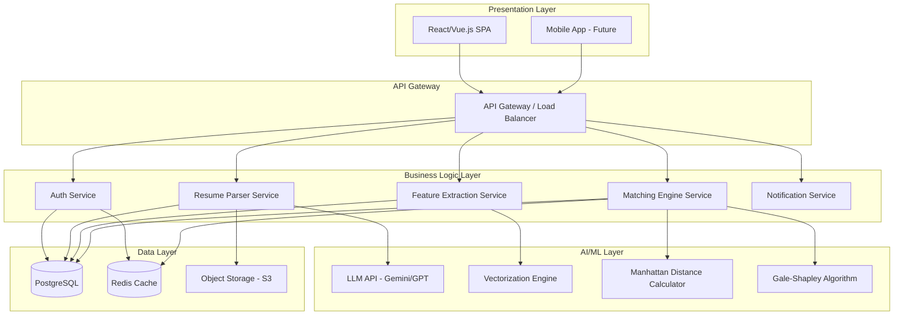
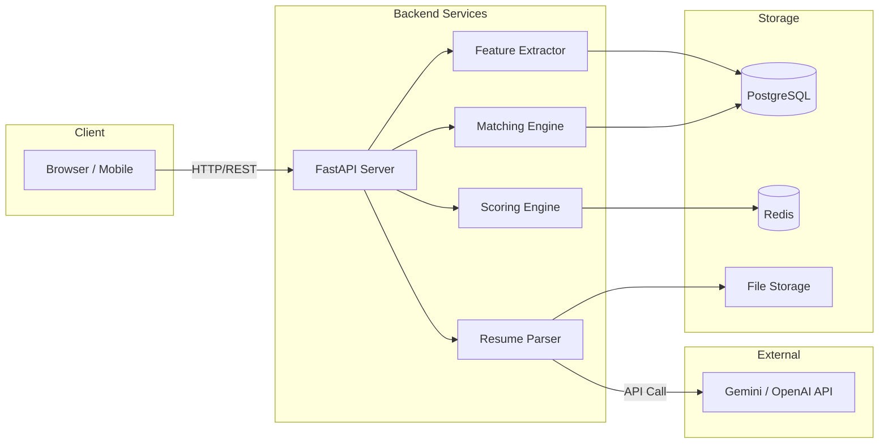
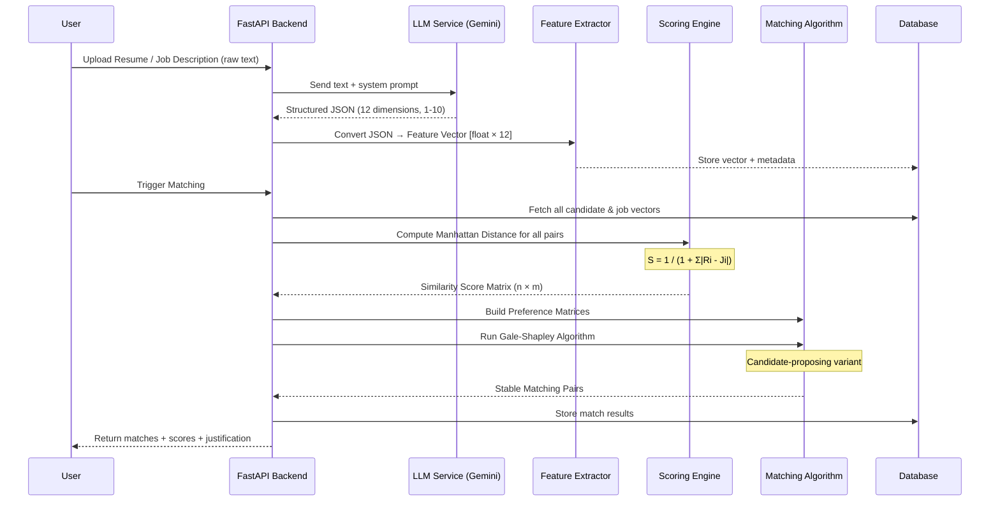
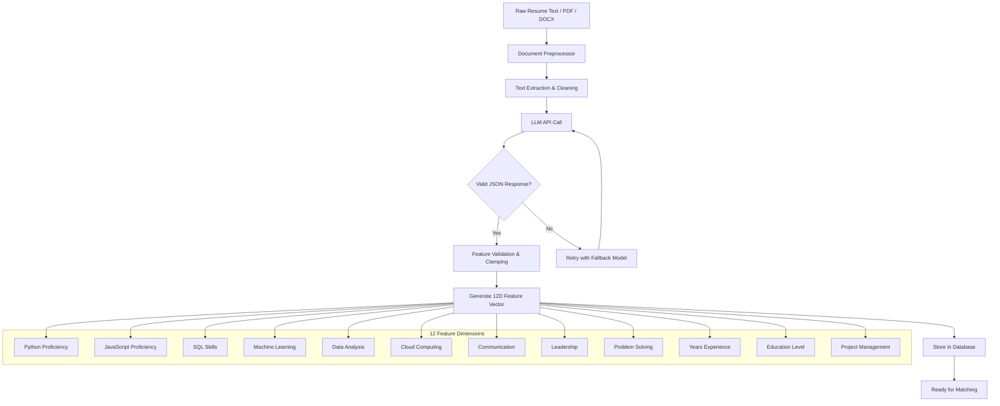
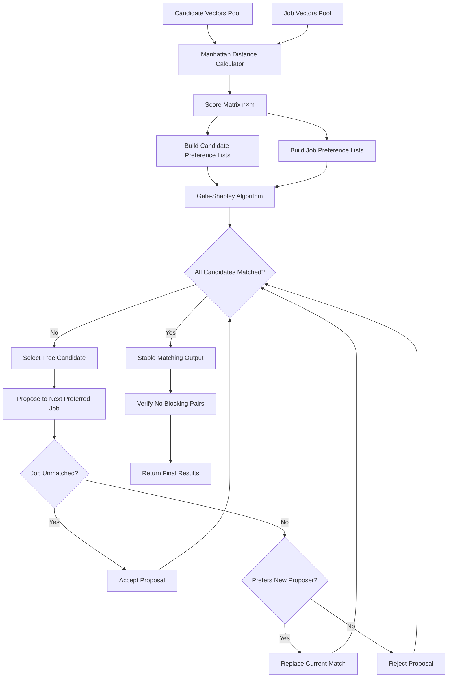
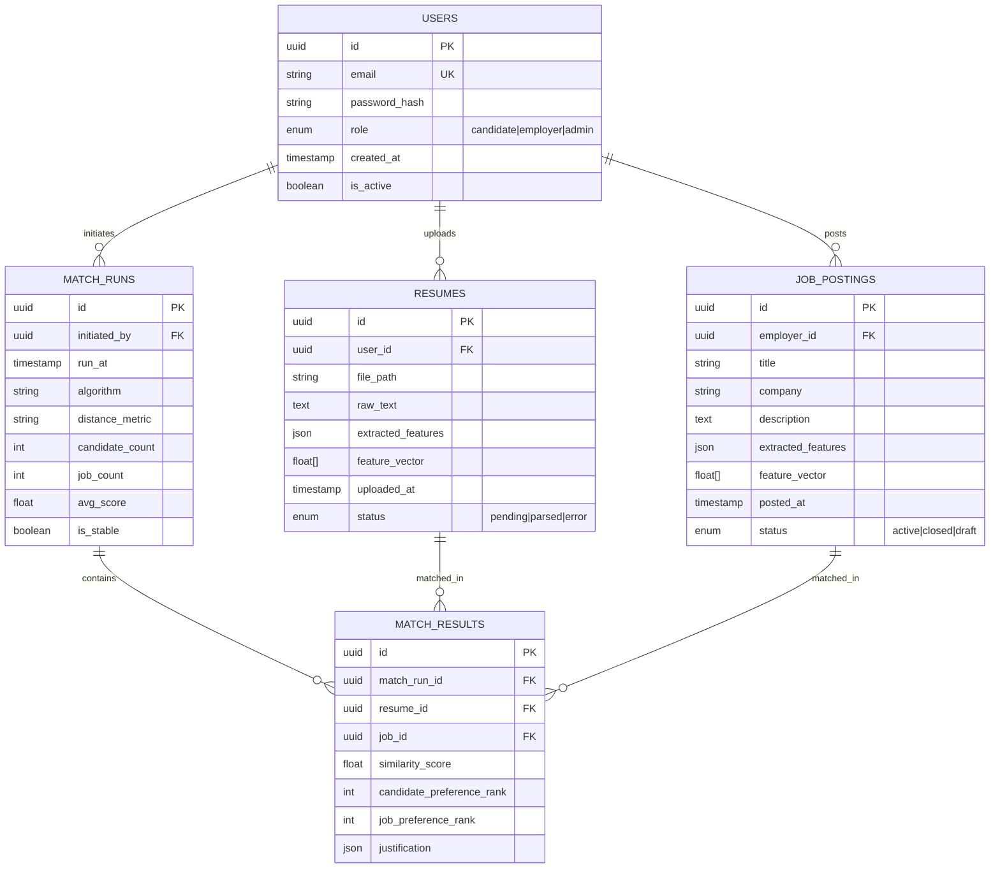
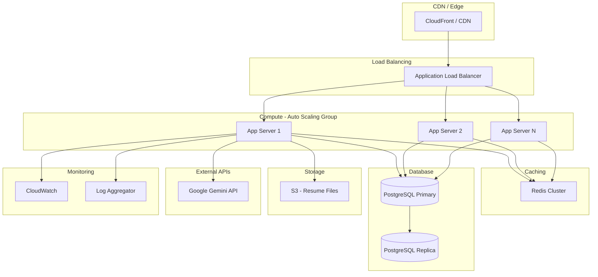
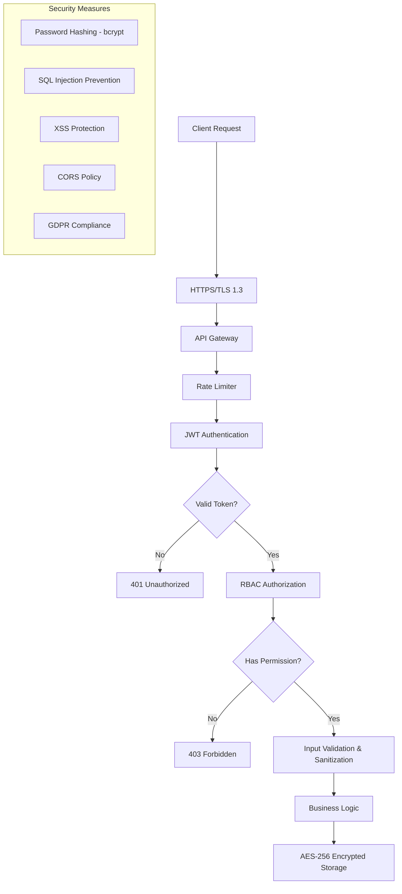
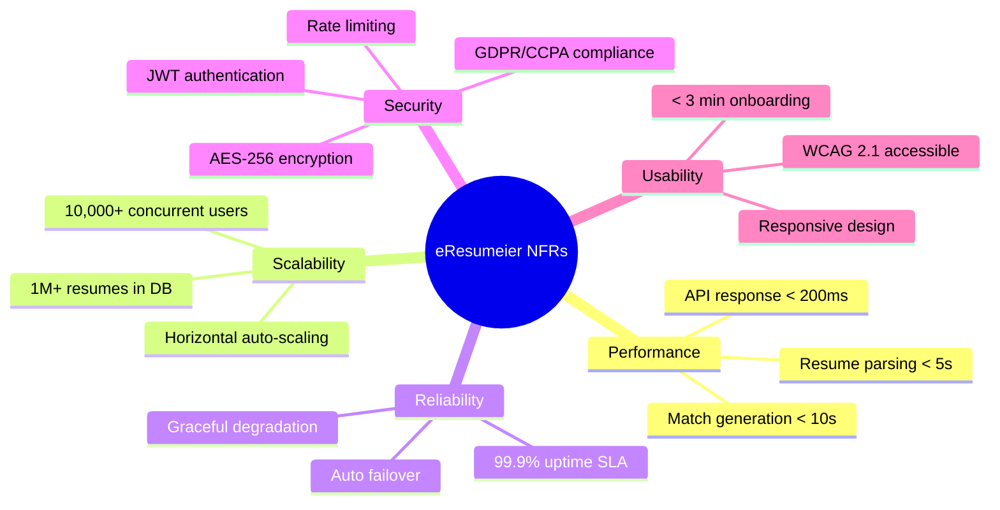

# eResumeier — High-Level Design (HLD)

## 1. System Architecture Overview

## 2. Component Architecture

## 3. Data Flow — Complete Matching Pipeline

## 4. Resume Parsing Pipeline (Detailed)

## 5. Matching Algorithm Flow

## 6. Database Schema (ER Diagram)

## 7. Deployment Architecture

## 8. Security Architecture

## 9. Technology Stack Summary

| Layer | Technology | Purpose |
|-------|-----------|---------|
| Frontend | React / Vue.js | Single Page Application |
| Backend | FastAPI (Python) | REST API Server |
| AI/LLM | Google Gemini / OpenAI GPT | Text parsing & feature extraction |
| Algorithm | Custom Python | Manhattan Distance + Gale-Shapley |
| Database | PostgreSQL | Persistent storage |
| Cache | Redis | Session & score caching |
| File Storage | AWS S3 | Resume file storage |
| Auth | JWT + bcrypt | Authentication & authorization |
| Deployment | AWS EC2 / Docker | Container orchestration |
| Monitoring | CloudWatch + ELK | Logging & alerting |

## 10. API Endpoints Design

| Method | Endpoint | Description |
|--------|----------|-------------|
| POST | `/api/auth/register` | User registration |
| POST | `/api/auth/login` | User login (returns JWT) |
| POST | `/api/resumes/upload` | Upload & parse resume |
| GET | `/api/resumes/{id}` | Get parsed resume details |
| POST | `/api/jobs` | Create job posting |
| GET | `/api/jobs` | List/search jobs |
| POST | `/api/match/run` | Trigger matching algorithm |
| GET | `/api/match/results/{run_id}` | Get match results |
| GET | `/api/match/history` | Get match history |
| GET | `/api/admin/users` | Admin: list users |
| GET | `/api/admin/health` | System health check |

## 11. Non-Functional Requirements Mapping

