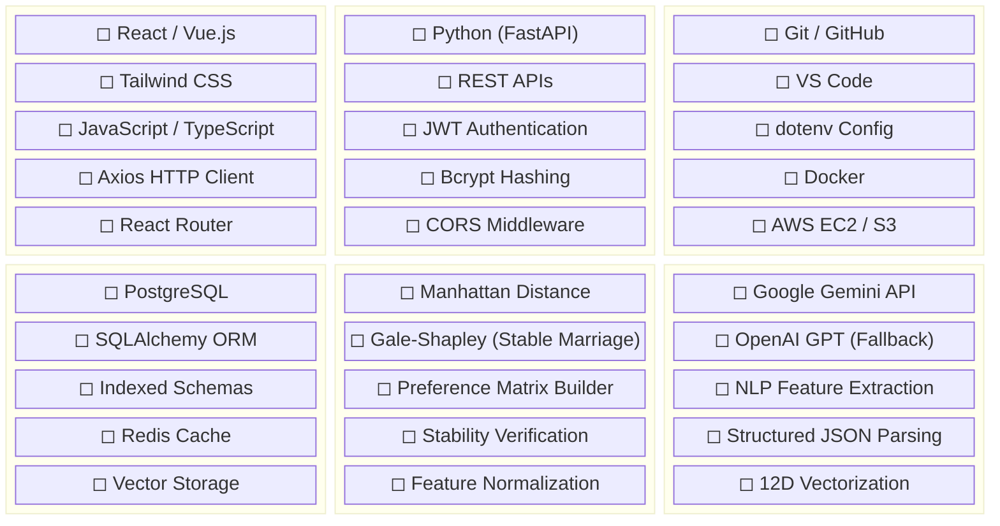

# eResumeier — Technology Stack

Use this Mermaid diagram to generate the visual (render at mermaid.live or export as image):

```mermaid
block-beta
    columns 3

    block:frontend["Frontend"]:1
        columns 1
        f1["◻ React / Vue.js"]
        f2["◻ Tailwind CSS"]
        f3["◻ JavaScript / TypeScript"]
        f4["◻ Axios HTTP Client"]
        f5["◻ React Router"]
    end

    block:backend["Backend"]:1
        columns 1
        b1["◻ Python (FastAPI)"]
        b2["◻ REST APIs"]
        b3["◻ JWT Authentication"]
        b4["◻ Bcrypt Hashing"]
        b5["◻ CORS Middleware"]
    end

    block:devops["DevOps"]:1
        columns 1
        d1["◻ Git / GitHub"]
        d2["◻ VS Code"]
        d3["◻ dotenv Config"]
        d4["◻ Docker"]
        d5["◻ AWS EC2 / S3"]
    end

    block:database["Database"]:1
        columns 1
        db1["◻ PostgreSQL"]
        db2["◻ SQLAlchemy ORM"]
        db3["◻ Indexed Schemas"]
        db4["◻ Redis Cache"]
        db5["◻ Vector Storage"]
    end

    block:algorithms["Algorithms"]:1
        columns 1
        a1["◻ Manhattan Distance"]
        a2["◻ Gale-Shapley (Stable Marriage)"]
        a3["◻ Preference Matrix Builder"]
        a4["◻ Stability Verification"]
        a5["◻ Feature Normalization"]
    end

    block:ai["AI / LLM Integration"]:1
        columns 1
        ai1["◻ Google Gemini API"]
        ai2["◻ OpenAI GPT (Fallback)"]
        ai3["◻ NLP Feature Extraction"]
        ai4["◻ Structured JSON Parsing"]
        ai5["◻ 12D Vectorization"]
    end
```
